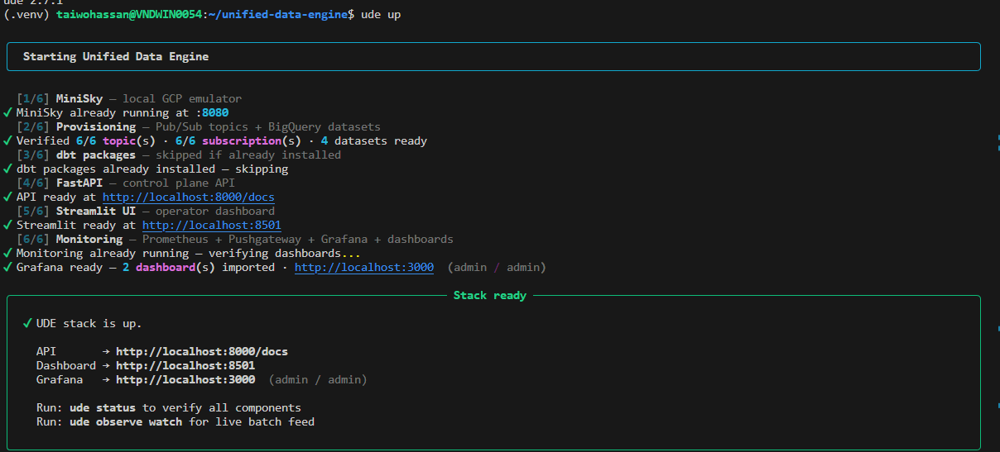
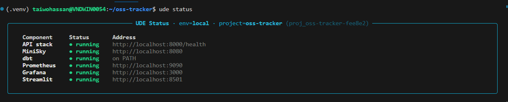
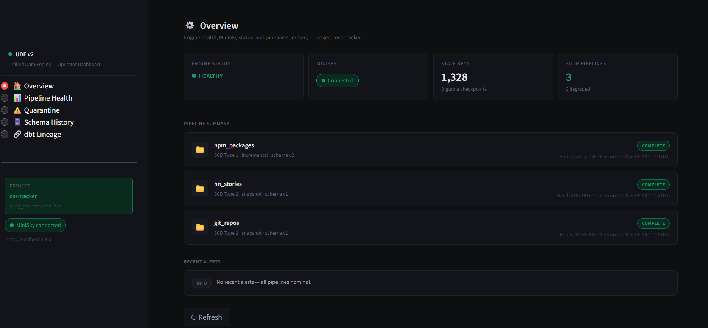
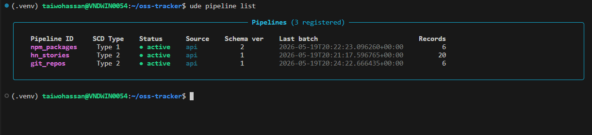
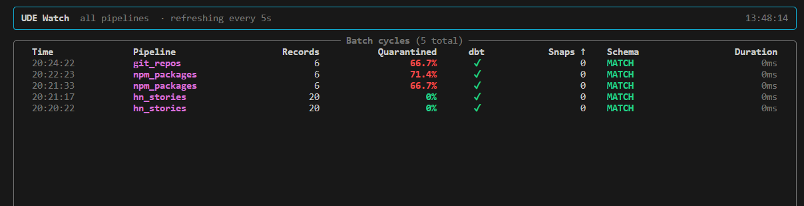
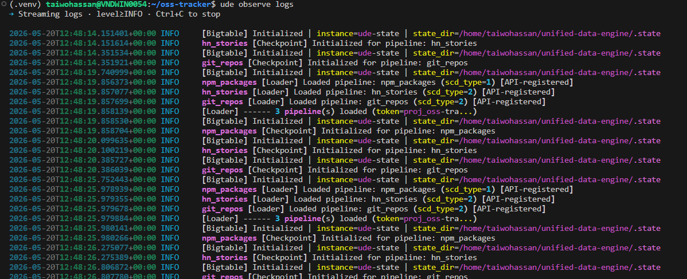
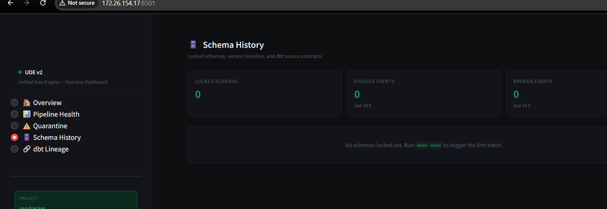
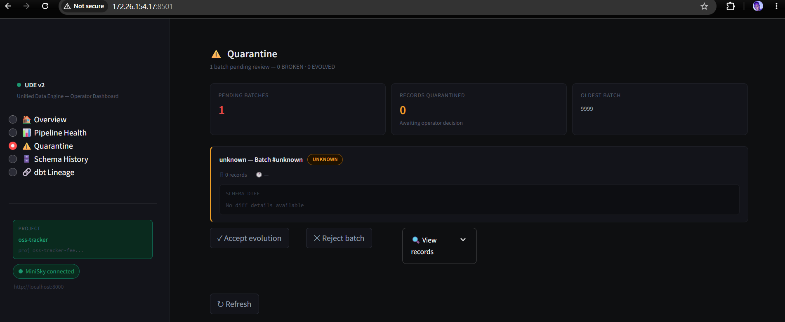
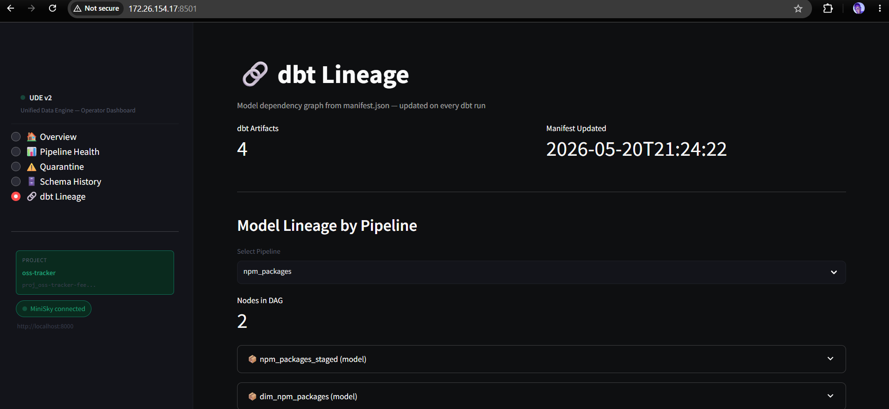
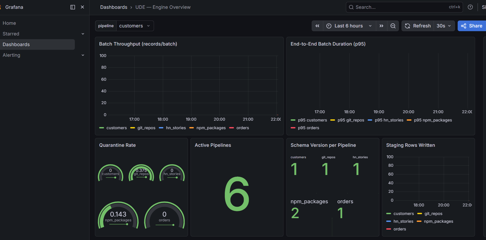

# OSS Tracker

A real-data project built on top of [Unified Data Engine (UDE)](https://github.com/tycoach/unified-data-engine) — a GCP-native, dbt-powered micro-batch pipeline engine.

Tracks GitHub repositories, NPM packages, and Hacker News stories in real time. All APIs are free and require no authentication (GitHub token optional for higher rate limits).

---

## Pipelines

| Pipeline | API | SCD Type | Natural Key | Cadence |
|---|---|---|---|---|
| `git_repos` | GitHub REST API | Type 2 — snapshot | `repo_full_name` | Every 30s |
| `npm_packages` | NPM Registry + Downloads API | Type 1 — incremental | `package_name` | Every 30s |
| `hn_stories` | HN Algolia API | Type 2 — snapshot | `story_id` | Every 30s |

`git_repos` and `hn_stories` use SCD Type 2 — full history of every star count change, score change, and issue count change is preserved in dbt snapshots. `npm_packages` uses SCD Type 1 — always reflects the latest version metadata.

---

## Prerequisites

- [Unified Data Engine](https://github.com/tycoach/unified-data-engine) stack running (`ude up`)
- Python 3.12+
- Docker (required by UDE for MiniSky)

---

## Installation

```bash
# 1. Install the UDE CLI
pip install unified-data-engine

# 2. Clone this repo
git clone https://github.com/tycoach/oss-tracker
cd oss-tracker

# 3. Create a virtual environment
python3 -m venv .venv
source .venv/bin/activate
pip install unified-data-engine
```

---

## Setup

### 1. Start the UDE stack

```bash
ude up
```



All 6 components start in sequence — MiniSky, provisioning, dbt, FastAPI, Streamlit, and Grafana with dashboards imported automatically.

### 2. Verify the stack

```bash
ude status
```



### 3. Initialise your project

```bash
ude init
```

Generates a project token (`proj_oss-tracker-...`) saved to `~/.ude/config.yml`. All subsequent CLI commands are scoped to this token — you only see your own pipelines.

### 4. Provision Pub/Sub topics

MiniSky loses state on restart. Run this after every `ude up`:

```bash
./provision.sh
```

### 5. Register the pipelines

```bash
ude pipeline register git_repos
ude pipeline register npm_packages
ude pipeline register hn_stories
```

### 6. Copy dbt files into UDE

```bash
cp dbt/models/staging/*.sql  ~/unified-data-engine/dbt/models/staging/
cp dbt/models/marts/*.sql    ~/unified-data-engine/dbt/models/marts/
cp dbt/snapshots/*.sql       ~/unified-data-engine/dbt/snapshots/
```

### 7. Start the data generator

```bash
python data-generator/fetch_oss.py
```

Optionally set a GitHub token for higher API rate limits (5000 req/hr vs 60):

```bash
export GITHUB_TOKEN=your_token_here
python data-generator/fetch_oss.py
```

---

## Operating

### Operator Dashboard



The Streamlit dashboard at **http://localhost:8501** shows engine health, MiniSky status, and a live pipeline summary scoped to your project token. Only your pipelines are visible.

### Check pipeline status

```bash
ude pipeline list
```



All 3 pipelines show as active with schema versions locked from the first real batch.

### Watch live batch feed

```bash
ude observe watch
```



Shows real-time batch cycles — records processed, quarantine rate, dbt status, schema match, and duration per pipeline.

### Stream engine logs

```bash
ude observe logs
```



### Inspect a pipeline

```bash
ude pipeline inspect git_repos
ude schema show git_repos
ude schema history npm_packages
```

### Schema History



Tracks every schema version, EVOLVED and BROKEN deviation events per pipeline.

### Review quarantined records

```bash
ude quarantine list
```



### dbt Lineage



The lineage page shows the full dbt DAG for each pipeline — staging models, mart models, and snapshots — updated on every dbt run from `manifest.json`. Scoped to your project token.

### Monitoring

Grafana at **http://localhost:3000** (admin / admin)



Includes batch throughput, end-to-end duration (p95), quarantine rate per pipeline, active pipeline count, schema version, and staging rows written.

---

## Project Structure

```
oss-tracker/
├── config/
│   └── pipelines/
│       ├── git_repos.yml         # SCD Type 2 — GitHub repos
│       ├── npm_packages.yml      # SCD Type 1 — NPM packages
│       └── hn_stories.yml        # SCD Type 2 — HN stories
├── dbt/
│   ├── models/
│   │   ├── staging/
│   │   │   ├── git_repos_staged.sql
│   │   │   ├── npm_packages_staged.sql
│   │   │   └── hn_stories_staged.sql
│   │   └── marts/
│   │       ├── dim_git_repos.sql
│   │       └── dim_npm_packages.sql
│   └── snapshots/
│       ├── git_repos_snapshot.sql
│       └── hn_stories_snapshot.sql
├── data-generator/
│   └── fetch_oss.py              # Polls GitHub, NPM, HN — publishes to Pub/Sub
├── img/                          # Screenshots
├── provision.sh                  # Reprovisioning script for MiniSky restarts
├── .env                          # MINISKY_HOST, PROJECT_ID, GITHUB_TOKEN
└── README.md
```

---

## Environment Variables

| Variable | Default | Description |
|---|---|---|
| `MINISKY_HOST` | `http://localhost:8080` | MiniSky API gateway |
| `MINISKY_PROJECT_ID` | `local-dev-project` | GCP project ID |
| `POLL_INTERVAL` | `30` | Data generator poll interval (seconds) |
| `GITHUB_TOKEN` | _(empty)_ | GitHub personal access token — optional, raises rate limit to 5000 req/hr |

Copy `.env` and fill in values:

```bash
cp .env .env.local
```

---

## Tracked Repos & Packages

**GitHub repos:**
- `dbt-labs/dbt-core`
- `pola-rs/polars`
- `tiangolo/fastapi`
- `apache/kafka`
- `streamlit/streamlit`
- `prometheus/prometheus`
- `tycoach/unified-data-engine`

**NPM packages:**
- `axios`, `lodash`, `express`, `react`, `typescript`, `eslint`, `prettier`

**HN stories:** top 20 results for `open source data engineering` — refreshed every cycle.

Edit `GITHUB_REPOS` and `NPM_PACKAGES` in `data-generator/fetch_oss.py` to track anything else.

---

## Built on UDE

This project is a consumer of the [Unified Data Engine](https://github.com/tycoach/unified-data-engine). It uses none of the engine's internal code — only the CLI and the pipeline YAML + dbt SQL conventions the engine expects.

The engine handles everything below the application layer: Pub/Sub consumption, schema inference and locking, edge case gating, dbt orchestration (run → snapshot → test), checkpointing, and observability.